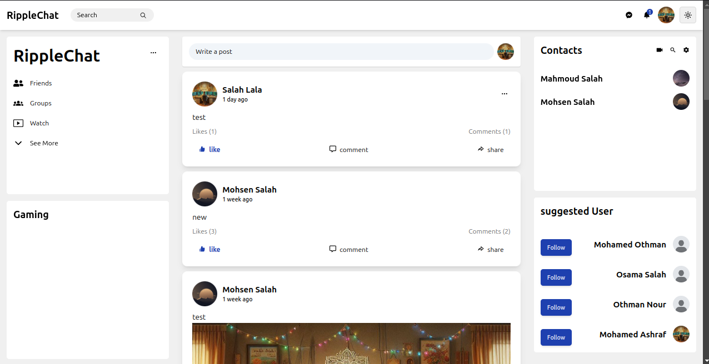
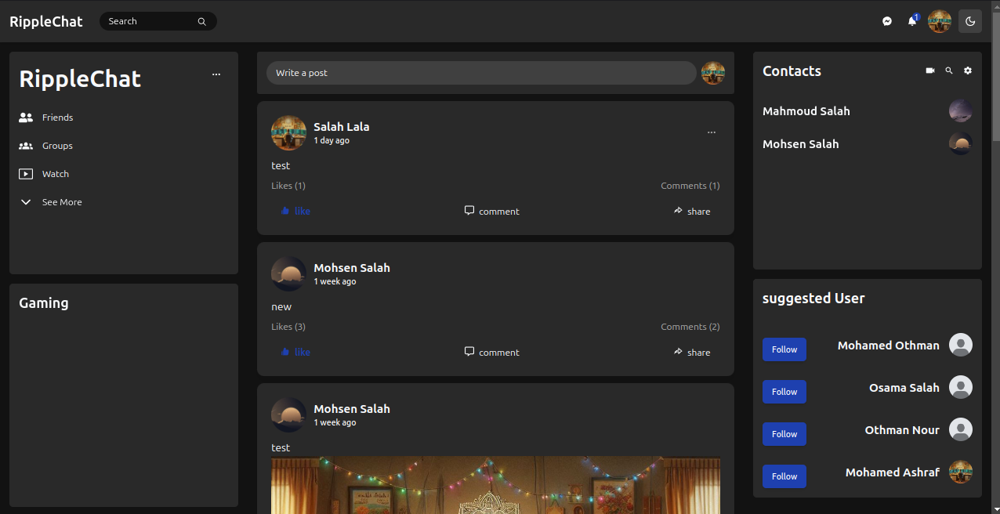
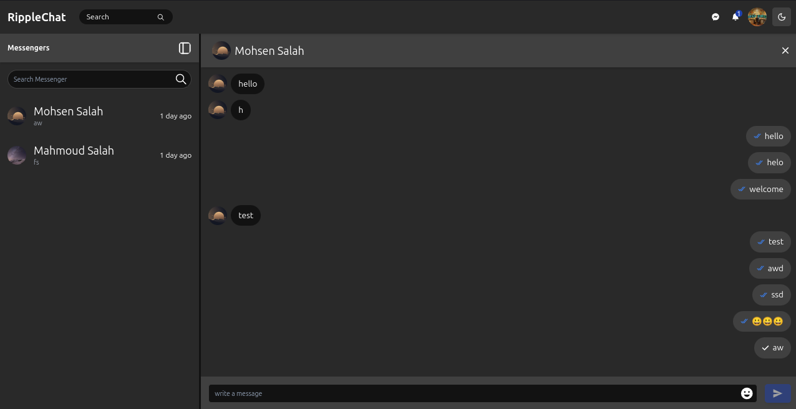
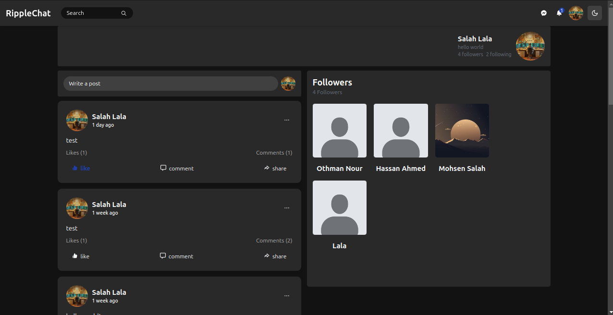

# MERN Stack Social Media Web App

## Features

- **User Authentication**: Sign up, log in, log out, and password reset (JWT-based).
- **Refresh Token**: Automatically renew access tokens using refresh tokens for persistent login.
- **Real-Time Messaging**: Send and receive messages in real-time.
- **Posts**: Create, edit, delete posts, and like/unlike posts.
- **Comments**: Add and delete comments on posts.
- **Notifications**: Receive notifications for likes, comments, and follows.
- **Follow System**: Follow and unfollow other users.
- **User Profiles**: Update profile pictures, usernames, and passwords.
- **Search**: Search for users by name.

## Technologies

- **Frontend**: React.js, Redux Toolkit
- **Backend**: Node.js, Express.js
- **Database**: MongoDB, Mongoose
- **Real-time**: Socket.io
- **Authentication**: JSON Web Tokens (JWT), bcrypt
- **Storage**: Cloudinary (for image uploads)
- **Styling**: Tailwind CSS , Shadcn UI

## Preview 

